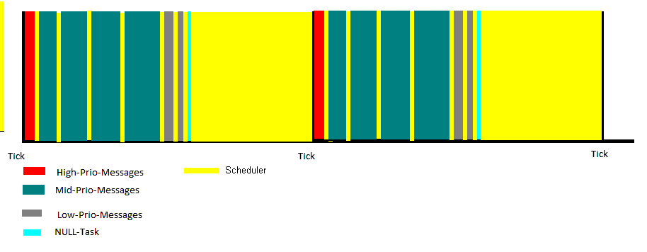

##VR-RTOS Polling Dokumentation 
Datum: 17. Nov. 2025

### 1.0 Allgemeines
Der Name leitet sich ab von ++V++olker ++R++umm ++R++eal ++T++ime ++O++perating ++S++ystem.
Polling bedeutet, dass alle Register gepollt werden un im ganzen System kein Interrupt implementiert ist.


### 1.1 Eigenschaften von VR-RTOS Polling
- Echtzeitfähiges kooperatives Message basiertes Multitaskingfähiges Betriebssystem.
- Alle Register werden gepollt, kein Interrupt aktiv.
- Kooperativ heißt dass die Abarbeitung einer Message nicht von einer anderen unterbrochen werden kann.
- Programmiersprache C
- Keine Abhängigkeiten von Compiler oder CPU
- Es wird nur ein HW-Timer benutzt
- Maximale Anzahl der Task : 32000
- Maximale Anzahl der Signale : 32000 (abhängig von der Datenbreite von enum)
- Jede Aktion wird von einer Message ausgelöst.
- Jede Message kann mit einer vorgegebenen Anzahl von Ticks verzögert werden.
- Jede Message beinhaltet eine Quell-Task, eine Ziel-Task, ein Sigmal plus zwei Parameter und die Anzahl der zu verzögernden Ticks.
- Folgende Signale sind vorgegeben und sollten nicht verändert werden :
-- SIG_INIT
-- SIG_START,
-- SIG_STOP,
-- SIG_TIME,
- Alle weiteren Signale können vom Programmierer frei definiert werden.
- Je nach Compiler können mindestens 65000 Signale definiert werden.
- Desweiteren hat jede Message eine Priorität :
-- Low
-- Mid
-- High
- Es gibt noch zwei spezielle Task :
-- Scheduler-Task : hat höchste Priorität im System
-- Null-Task : hat niedrigste Priorität im System
- Messages mit höherer Priorität verdrängen Messages mit niedriger Priorität.
- Wenn nach Abarbeitung aller Messeges innerhalt eines Ticks noch Zeit ist wird die TASK_NULL aufgerufen. In dieser werden die Statistiken (CPU-Load usw. berechnet). Sie kann auch für andere Zwecke benutzt werden z.B. im Hintergrund die Checksumme des Flashs ermitteln. Diese Task nimmt anderen Tasks keine Rechenzeit weg.
- Die Scheduler-Task wird aufgerufen wenn der Scheduler aktiv ist.
- Null-Task und Scheduler-Task können keine Messages empfangen.
- Die Anzahl der Messages pro Priorität kann per #define eingestellt werden.
- Idealerweise werden alle aktiven Messages innerhalb eines Ticks abgearbeitet.
- Jede Priorität kann per #define aktiviert oder deaktiviert werden.
- Bei jedem Tick werden die verzögerten Messages die Warte-Ticks um 1 dekrementiert.
- Eine Message ist zuteilungsreif wenn die Warte-Ticks den Wert 0 hat.
- Die Dauer der Abarbeitung einer Message wird gemessen. Dadurch kann die CPU-Auslastung gemessen werden. Die maximale Dauer einer Message kann pro Task eingestellt werden (MaxTime in TaskArray). Wird die Dauer überschritten wird die Message SIG_ERR_OVERTIME an die ErrorManager-Task geschickt.
- Kann eine Message nicht gesendet werden weil die Message-Liste voll ist wird die Message SIG_ERR_LOST_MSG an die ErrorManager-Task geschickt.
- Der Benutzer kann weitere ERROR-Signale definieren und implementieren.



Flussdiagramm :


###2 Dateien von VR-RTOS-Scheduler
VR-RTOS besteht aus folgenden Dateien
- include\SCHEDULER\SCHEDULER.h (nicht ändern)
- include\SCHEDULER\SCHEDULER_Config\SCHEDULER_Cfg.h (muss angepasst werden)
- src\SCHEDULER\SCHEDULER.c (nicht ändern)
- src\SCHEDULER\SCHEDULER_Config\SCHEDULER_Cfg.inc (muss angepasst werden)

folgende Anpassungen müssen in SCHEDULER_CFG.h vorgenommen werden :
- Vordeklarationen der verwendeten Funktionen do_Task_XXX()
- VR_RTOS_HIGH_PRIO_USE 
- VR_RTOS_LOW_PRIO_USE
- VR_RTOS_NULLTASK_USE
- VR_RTOS_STATISTICS
- VR_RTOS_HISTORY
- VR_RTOS_HISTORY_SIZE
- MAX_MSGS_HIGH 
- MAX_MSGS_MID
- MAX_MSGS_LOW
- defines für die einzelnen Tasks
- Sig_e anpassen

folgende Anpassungen müssen in SCHEDULER_CFG.inc vorgenommen werden :

- TaskArr anpassen
- SchedulerTask anpassen

jeder Eintrag in TaskArr besteht aus :

| Eintrag     | Erklärung                                |
|-------------|--------------------------------------------|
| TaskName    | Name der Task, muss angepasst werden |
| doTaskFunc  | Name der Task-Funktion, muss angepasst werden |
| Task_On     | wird intern verwendet |
| Trace_On    | wird intern verwendet |
| SumTime     | Statistik, wird intern verwendet
| PercentTime | Statistik, wird intern verwendet
| MaxTime     | Max. Anzahl der Timer-Schritte zur Überwachung der Dauer eines Message-Aufrufes. Wenn 0 dann keine Überwachung. Muss angepasst werden

Durch die Überwachung der Dauer eines Message-Aufrufs durch den Scheduler ist kein Watchdog hierfür erforderlich.
Der Watchdog ist so einzustellen dass er auslöst wenn das System hängt, z.B. bei 2 x OS-Tick. 

###3 Verwendung von VR-RTOS

++3.0 Start des Systems++

main.c :: main()
- Konfigurieren des SysTick-Timers
- Initialisierung aller Ein- und Ausgänge (HAL_Init_XXX())
- Initialisierung des Schedulers  (VR_RTOS_Init())
- Starten der StartupTask :
-- uint8_t TaskStartupNo = VR_RTOS_Get_TaskNo((uint8_t *)STR_TASK_STARTUP);
-- VR_RTOS_Init_Task(TaskStartupNo, 0, 0);
-- VR_RTOS_Start_Task(TaskStartupNo);
- Scheduler aufrufen : 
-- VR_RTOS_Run();

Starten der Task TASK_STARTUP : VR_RTOS_Start_Task(TASK_STARTUP); : ruft die Funktion Task_Startup.c::do_Task_StartUp() mit dem Signal SIG_START auf
- Starten VR-RTOS : VR_RTOS_Run();

Mit der Startup-Ttask werden alle erforderlichen Tasks der Reihe nach gestartet.
Dadurch kann der Start einer Task verzögert werden z.B. bis eine Spannung vorhanden ist.
Des weiteren werden die Tasks nacheinander in vordefinierter Reihenfolge gestartet.
Wurden alle Tasks gestartet beendet sich die TASK_STARTUP selbst mit VR_RTOS_Stop_Task(MY_TASK);

###4 Defines und Funktionen von VR-RTOS
allgemeine defines

| define                    | Erklärung                                                     |
|---------------------------|---------------------------------------------------------------|
| NO_TICK                   | define für 0 Ticks, Zuteilung soll im aktuellen Tick erfolgen |
| NEXT_TICK                 | define für 1 Tick, Zuteilung soll im nächsten Tick erfolgen   |

allgemeine Funktionen

| Funktion                      | Erklärung                               |
|-------------------------------|-----------------------------------------|
| VR_RTOS_Run()                 | Message-Scheduler (=Endlosschleife)     |
| VR_RTOS_CalcMsToTicks()       | Wandelt mms in Ticks um                 |
| VR_RTOS_getTickSinceStart()   | Liefert die Anzahl der Ticks seit Start |


Message Funktionen

| Funktion                                 | Erklärung                                  |
|------------------------------------------|--------------------------------------------|
| VR_RTOS_SendMsg_LowPrio()                | Sendet Low-Prio-Message an Task            |
| VR_RTOS_SendMsg_Broadcast_LowPrio()      | Sendet Low-Prio-Message an alle Tasks      |
|------------------------------------------|--------------------------------------------|
| VR_RTOS_SendMsg_MidPrio()                | Sendet Mid-Prio-Message an Task            |
| VR_RTOS_SendMsg_Broadcast_MidPrio()      | Sendet Mid-Prio-Message an alle Tasks      |
|------------------------------------------|--------------------------------------------|
| VR_RTOS_SendMsg_HighPrio()               | Sendet High-Prio-Message an Task           |
| VR_RTOS_SendMsg_Broadcast_HighPrio()     | Sendet High-Prio-Message an alle Tasks     |
|------------------------------------------|--------------------------------------------|

Funktionen zum steuern der Tasks (es werden keine Messages versendet, es wird die Funktion do_Task_XXX direkt aufgerufen)

| Funktion               | Erklärung                  |
|------------------------|----------------------------|
| VR_RTOS_Init_Task()    | Initialisiert eine Task    |
| VR_RTOS_Start_Task()   | Startet eine Task          |
| VR_RTOS_Stop_Task()    | Stopt eine Task            |
| VR_RTOS_Is_Task_On()   | Liefert Info ob Task aktiv |
| VR_RTOS_Get_TaskName() | Liefert Name einer Task    |
| VR_RTOS_Get_TaskNo()   | Liefert ID Task            |

Trace-Funktionen

| Funktion               | Erklärung                   |
|------------------------|-----------------------------|
| VR_RTOS_Trace_U8()     | Trace für U8-String         |
| VR_RTOS_Trace_CStr()   | Trace für String mit Ende 0 |

###5 Beispielprogramme mit VR-RTOS
++5.1 Keyboard++
```
#include <string.h>

#include "SCHEDULER.h"
#include "HAL_DigIn.h"

#define TICK_REPEAT   (5)    // 5ms
#define CNT_50MS      (50)   // 50ms
#define CNT_1S        (1000) // 1s

static uint8_t  s_MyTaskNo=INVALID_TASKNO;
static uint8_t  s_TaskEditNo=INVALID_TASKNO;
static uint8_t  s_DigIn_KeyPlus=0;
static uint8_t  s_DigIn_KeyMinus=0;

void do_Task_KEY(uint8_t TaskFrom, Sig_e Sig, para_t Para1, para_t Para2)
{
  static s_nKeyCountPlus=0;
  static s_nKeyCountMinus=0;

  switch (Sig)
  {
    case SIG_INIT : 
      s_MyTaskNo = VR_RTOS_Get_TaskNo((uint8_t *)STR_TASK_KEYBOARD);
      s_TaskEditNo = VR_RTOS_Get_TaskNo((uint8_t *)STR_TASK_EDIT);
      s_DigIn_KeyPlus = HAL_Get_DigIn_No(STR_DIGIN_KEY_PLUS);
      s_DigIn_KeyMinus = HAL_Get_DigIn_No(STR_DIGIN_KEY_MINUS);
      break;
 
    case SIG_START :
      VR_RTOS_SendSIG_MidPrio(s_MyTaskNo, s_MyTaskNo, SIG_TIME, 0, 0, VR_RTOS_CalcMsToTicks(TICK_REPEAT));
      break;
 
    case SIG_STOP :
      // do nothing
      break;
 
    case SIG_TIME :
      VR_RTOS_SendSIG_MidPrio(s_MyTaskNo, s_MyTaskNo, SIG_TIME, 0, 0, VR_RTOS_CalcMsToTicks(TICK_REPEAT));
      if (get_DigIn(DI_KEY_PLUS))
      {
        s_nKeyCountMinus = 0;

        s_nKeyCountPlus++;
        if (s_nKeyCountPlus == CNT_50MS)
        {
        // single key
          VR_RTOS_SendMsg_LowPrio(s_MyTaskNo, s_TaskEditNo, SIG_KEY_PLUS, 0, 0);
        }
        else if (s_nKeyCountPlus > CNT_1S)
        {
          // repeat key
          VR_RTOS_SendMsg_LowPrio(s_MyTaskNo, s_TaskEditNo, SIG_KEY_PLUS_10, 0, 0);
          s_nKeyCountPlus = CNT_50MS;
        }
      } 
      else if (get_DigIn(DI_KEY_MINUS))
      {
        s_nKeyCountPlus = 0;

        s_nKeyCountMinus++;
        if (s_nKeyCountMinus == CNT_50MS)
        {
        // single key
          VR_RTOS_SendMsg_LowPrio(s_MyTaskNo, s_TaskEditNo, SIG_KEY_MINUS, 0, 0);
        }
        else if (s_nKeyCountMinus > CNT_1S)
        {
          // repeat key
          VR_RTOS_SendMsg_LowPrio(s_MyTaskNo, s_TaskEditNo, SIG_KEY_MINUS_10, 0, 0);
          s_nKeyCountMinus = CNT_50MS;
        }
      }
      else
      {
        s_nKeyCountPlus = 0;
        s_nKeyCountMinus = 0;
      }
      break; 
  }
}
```

++5.2 Edit++
Hier ein Beispiel edit das die Signale aus Beispiel 5.1 Keyboard verwendet.
```
#include <string.h>

#include "SCHEDULER.h"

static uint8_t  s_MyTaskNo=INVALID_TASKNO;

// No Tick required !!!

void do_Task_EDIT(int Sig, int Para1, int Para2)
{
  switch (Sig)
  {
    case SIG_INIT : 
      s_MyTaskNo = VR_RTOS_Get_TaskNo((uint8_t *)STR_TASK_EDIT);
      break;
 
    case SIG_START :
      // do nothing
      break;
 
    case SIG_STOP :
      // do nothing
      break;
 
    case SIG_TIME :
      // do nothing
      break;
 
    case SIG_KEY_PLUS :
      Freq++; 
      break;
 
    case SIG_KEY_PLUS_10 :
      Freq += 10; 
      break;
 
    case SIG_KEY_MINUS :
      if (Freq > 0)
        Freq--; 
      break;
 
    case SIG_KEY_MINUS_10 :
      if (Freq > 10)
        Freq -= 10; 
	  else
        Freq = 0;
      break;
  }
}
```

++5.3 Display++
In diesem Beispiel wird alle 250ms der Inhalt eines Arrays "DispContent" an das Display gesendet. Die verwendeten Messages sind Low Prio. Dadurch können diese Messages auf mehrere Ticks verteilen da die Messages mit höherer Priorität Vorrang vor diesen Messages hat. 
Oder anders ausgedrückt :
Diese Task wird immer dann ausgeführt wenn 
1. Die Zeit von 250ms abgelaufen ist und
2. Wenn innerhalb eines Ticks keine andere Message abearbeitet werden muss.

Oder nochmal anders ausgedrückt :
Diese Task füllt die Lücke innerhalb eines Ticks.

```
#include <string.h>

#include "SCHEDULER.h"


#define TICK_DISPLAY   (250) // 250 ms

static uint8_t  s_MyTaskNo=INVALID_TASKNO;

void do_Task_Display(uint8_t TaskFrom, Sig_e Sig, para_t Para1, para_t Para2)
{
  uint16_t idx;

  switch (Sig)
  {
    case SIG_INIT : 
      InitDisplay();
      s_MyTaskNo = VR_RTOS_Get_TaskNo((uint8_t *)STR_TASK_DISPLAY);
      break; 

    case SIG_START :
      VR_RTOS_SendMsg_LowPrio(s_MyTaskNo, s_MyTaskNo, 0, 0, VR_RTOS_CalcMsToTicks(TICK_DISPLAY));
      break; 

    case SIG_TIME :
      VR_RTOS_SendMsg_LowPrio(s_MyTaskNo, s_MyTaskNo, 0, 0, VR_RTOS_CalcMsToTicks(TICK_DISPLAY));
      createContentDisplay();
      // send the content of the display in 16 parts a 64 bytes
      VR_RTOS_SendMsg_LowPrio(s_MyTaskNo, MY_TASK, SIG_TRANSFER_DISPLAY, 0, 0, NO_TICK);
      break; 

    case SIG_STOP :
      // do nothing
      break;
 
    case SIG_TRANSFER_DISPLAY :
      idx = Msg->Para1;
      for (uint16_t i=0; i<64; i++)
        sendToDisplay(DispContent[idx++]);
      if (idx < 1024)
        VR_RTOS_SendMsg_LowPrio(s_MyTaskNo, s_MyTaskNo, SIG_TRANSFER_DISPLAY, idx, 0, NO_TICK);
      break; 
  }
}
```
Zur Veranschaulichung 


++5.4 Lauflicht mit verschiedenen Signalen++
In diesem Beispiel wird ein Lauflicht mittels unterschiedlichen Signalen realisiert.
```
#include <string.h>

#include "SCHEDULER.h"

#define TICK_START    (100) // 100 ms
#define TICK_REPEAT   (300) // 300 ms

static uint8_t  s_MyTaskNo=INVALID_TASKNO;


void do_Task_RUNNING_LED(int Sig, int Para1, int Para2)
{
  switch (Sig)
  {
    case SIG_INIT : 
      Init_DOut_LED();
      s_MyTaskNo = VR_RTOS_Get_TaskNo((uint8_t *)STR_TASK_RUNNUNGLIGHT);
      break; 

    case SIG_START :
      VR_RTOS_SendMsg_LowPrio(s_MyTaskNo, s_MyTaskNo, SIG_LED_0, 0, 0, VR_RTOS_CalcMsToTicks(TICK_START));
      break; 

    case SIG_TIME :
      // do nothing
      break;
      
    case SIG_LED_0 :
      Set_Led_Off();
      VR_RTOS_SendMsg_LowPrio(s_MyTaskNo, s_MyTaskNo, SIG_LED_1, 0, 0, VR_RTOS_CalcMsToTicks(TICK_REPEAT));
      break;
      
    case SIG_LED_1 :
      Set_Led_1();
      VR_RTOS_SendMsg_LowPrio(s_MyTaskNo, s_MyTaskNo, SIG_LED_2, 0, 0, VR_RTOS_CalcMsToTicks(TICK_REPEAT));
      break;
      
    case SIG_LED_2 :
      Set_Led_2();
      VR_RTOS_SendMsg_LowPrio(s_MyTaskNo, s_MyTaskNo, SIG_LED_3, 0, 0, VR_RTOS_CalcMsToTicks(TICK_REPEAT));
      break;
      
    case SIG_LED_3 :
      Set_Led_3();
      VR_RTOS_SendMsg_LowPrio(s_MyTaskNo, s_MyTaskNo, SIG_LED_0, 0, 0, VR_RTOS_CalcMsToTicks(TICK_REPEAT));
      break;
  }
}
```

++5.5 Lauflicht mit einem Signal und verschiedenen Parametern++
In diesem Beispiel wird ein Lauflicht mittels unterschiedlichen Parametern realisiert.
```
#include <string.h>

#include "vr-rtos.h"#include "SCHEDULER.h"
#define TICK_START    (100) // 100 ms
#define TICK_REPEAT   (300) // 300 ms

#define LED_OFF       0
#define LED_1         1
#define LED_2         2
#define LED_3         3


void do_Task_RUNNING_LED(int Sig, int Para1, int Para2)
{
  switch (Sig)
  {
    case SIG_INIT : 
      Init_DOut_LED();
      s_MyTaskNo = VR_RTOS_Get_TaskNo((uint8_t *)STR_TASK_RUNNUNGLIGHT);
      break; 

    case SIG_START :
      VR_RTOS_SendMsg_LowPrio(s_MyTaskNo, s_MyTaskNo, SIG_LED, LED_OFF, 0, VR_RTOS_CalcMsToTicks(TICK_START));
      break; 

    case SIG_TIME :
      // do nothing
      break;
      
    case SIG_LED :
      switch (Para1)
      {
        case LED_OFF :
          Set_Led_Off();
          VR_RTOS_SendMsg_LowPrio(s_MyTaskNo, s_MyTaskNo, SIG_LED, LED_1, 0, VR_RTOS_CalcMsToTicks(TICK_REPEAT));
          break;

        case LED_1 :
          Set_Led_1();
          VR_RTOS_SendMsg_LowPrio(s_MyTaskNo, s_MyTaskNo, SIG_LED, LED_2, 0, VR_RTOS_CalcMsToTicks(TICK_REPEAT));
          break;

        case LED_2 :
          Set_Led_2();
          VR_RTOS_SendMsg_LowPrio(s_MyTaskNo, s_MyTaskNo, SIG_LED, LED_3, 0, VR_RTOS_CalcMsToTicks(TICK_REPEAT));
          break;

        case LED_3 :
          Set_Led_3();
          VR_RTOS_SendMsg_LowPrio(s_MyTaskNo, s_MyTaskNo, SIG_LED, LED_OFF, 0, VR_RTOS_CalcMsToTicks(TICK_REPEAT));
          break;
      }
      break;
  }
}
```

