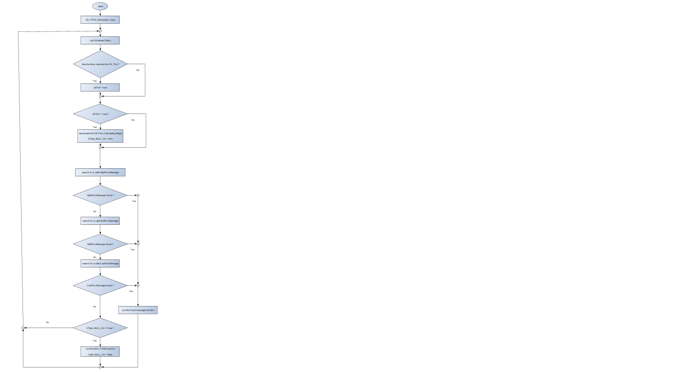
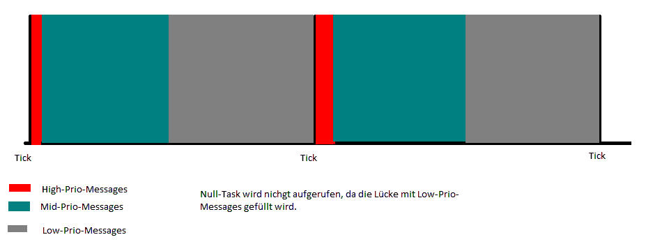

##Descripion VR-RTOS Polling
Date: November 17, 2025

### 1.0 General

The name is derived from ++V++olker ++R++umm ++R++eal ++T++ime ++O++operating ++S++ystem.
Polling means that all registers are polled and no interrupts are implemented in the entire system.


### 1.1 VR-RTOS Polling Features

- Real-time cooperative message based multitasking operating system.
- All registers are polled; no interrupts are active.
- Cooperative means that the processing of one message cannot be interrupted by another.
- Programming language: C
- No dependencies on a compiler or CPU
- Only one HW Timer is used
- Maximum number of tasks: 32,000
- Maximum number of signals: 32,000 (depending on the data width of the enum)
- Every action is triggered by a message.
- Each message can be delayed by a specified number of ticks.
- Each message contains a source task, a destination task, a sigma plus two parameters, and the number of ticks to be delayed.
- The following signals are predefined and should not be changed:
-- SIG_INIT
-- SIG_START
-- SIG_STOP
-- SIG_TIME
- All other signals can be freely defined by the programmer.
- Depending on the compiler, at least 65,000 signals can be defined.
- Furthermore, each message has a priority:
-- Low
-- Mid
-- High
- There are also two special tasks:
-- Scheduler task: has the highest priority in the system
-- Null task: has the lowest priority in the system
- Messages with a higher priority override messages with a lower priority.
- If there is still time after all messages have been processed within a tick, TASK_NULL is called. This task calculates statistics (CPU load, etc.). It can also be used for other purposes, such as determining the flash memory checksum in the background. This task does not consume any processing time from other tasks.
- The scheduler task is called when the scheduler is active.
- The null task and the scheduler task cannot receive messages.
- The number of messages per priority can be set using `#define`.
- Ideally, all active messages are processed within one tick.
- Each priority can be enabled or disabled using `#define`.
- With each tick, the wait ticks for delayed messages are decremented by 1.
-  A message is ready for allocation when the wait ticks are 0.
- The processing time of a message is measured. This allows CPU utilization to be measured. The maximum duration of a message can be set per task (`MaxTime` in TaskArray`). If the duration is exceeded, the message SIG_ERR_OVERTIME is sent to the ErrorManager task.
- If a message cannot be sent because the message list is full, the message SIG_ERR_LOST_MSG is sent to the ErrorManager task.
- The user can define and implement additional error signals.


Flussdiagramm :


###2 Files of VR-RTOS-Scheduler
VR-RTOS consists of the following files:
- include\SCHEDULER\SCHEDULER.h (do not modify)
- include\SCHEDULER\SCHEDULER_Config\SCHEDULER_Cfg.h (must be modified)
- src\SCHEDULER\SCHEDULER.c (do not modify)
- src\SCHEDULER\SCHEDULER_Config\SCHEDULER_Cfg.inc (must be modified)

The following modifications must be made in SCHEDULER_CFG.h :
- Predeclarations of the used functions do_Task_XXX()
- VR_RTOS_HIGH_PRIO_USE 
- VR_RTOS_LOW_PRIO_USE
- VR_RTOS_NULLTASK_USE
- VR_RTOS_STATISTICS
- VR_RTOS_HISTORY
- VR_RTOS_HISTORY_SIZE
- MAX_MSGS_HIGH 
- MAX_MSGS_MID
- MAX_MSGS_LOW
- defines for the individual tasks
- adjust Sig_e

folgende Anpassungen müssen in SCHEDULER_CFG.inc vorgenommen werden :
- Adjust TaskArr
- Adjust SchedulerTask

Each entry in TaskArr consists of :

| Entry     | Explanation                                |
|-------------|--------------------------------------------|
| TaskName    | Name of the Task, needs to be adjusted |
| doTaskFunc  | Name of the Task Funktion, needs to be adjusted |
| Task_On     | for internal use |
| Trace_On    | for internal use |
| SumTime     | Statistics for internal use
| PercentTime | Statistics, for internal use
| MaxTime     | Maximum number of timer steps for monitoring the duration of a message call. If 0, then no monitoring. Needs to be adjusted.

Since the scheduler monitors the duration of a message call, a watchdog is not required.

The watchdog should be configured to trigger when the system hangs, e.g., after two OS ticks. 


###3 Using VR-RTOS

++3.0 Starting the System++

main.c :: main()
- Configure the SysTick timer
- Initialize all inputs and outputs (HAL_Init_XXX())
- Initialize the scheduler (VR_RTOS_Init())
- Start the StartupTask :
-- uint8_t TaskStartupNo = VR_RTOS_Get_TaskNo((uint8_t *)STR_TASK_STARTUP);
-- VR_RTOS_Init_Task(TaskStartupNo, 0, 0);
-- VR_RTOS_Start_Task(TaskStartupNo);
- Call the scheduler : 
-- VR_RTOS_Run();

Start the task TASK_STARTUP: VR_RTOS_Start_Task(TASK_STARTUP); : calls the function Task_Startup.c::do_Task_StartUp() with the signal SIG_START
- Start VR-RTOS : VR_RTOS_Run();

The startup task starts all necessary tasks sequentially.
This allows the start of a task to be delayed, e.g., until a voltage is present.
Furthermore, the tasks are started one after the other in a predefined order.
Once all tasks have started, TASK_STARTUP terminates itself with VR_RTOS_Stop_Task(MY_TASK);

###4 Defines und Functions of VR-RTOS
General defines

| define                    | Explanation                                                      |
|---------------------------|---------------------------------------------------------------|
| NO_TICK                   | define for 0 ticks, allocation should occur in the current tick |
| NEXT_TICK                 | define for 1 tick, allocation should occur in the next tick   |

General Functions
| Function                      | Explanation                                |
|-------------------------------|-----------------------------------------|
| VR_RTOS_Run()                 | Message Scheduler (endless loop)     |
| VR_RTOS_CalcMsToTicks()       | Converts ms to ticks                |
| VR_RTOS_getTickSinceStart()   | Returns the number of ticks since start |


Message Functions

| Function                                 | Explanation                                  |
|------------------------------------------|--------------------------------------------|
| VR_RTOS_SendMsg_LowPrio()                | Sends low priority message to task            |
| VR_RTOS_SendMsg_Broadcast_LowPrio()      | Sends low priority message to all task      |
|------------------------------------------|--------------------------------------------|
| VR_RTOS_SendMsg_MidPrio()                |Sends mid priority message to task          |
| VR_RTOS_SendMsg_Broadcast_MidPrio()      | Sends mid priority message to all task      |
|------------------------------------------|--------------------------------------------|
| VR_RTOS_SendMsg_HighPrio()               | Sends high priority message to task         |
| VR_RTOS_SendMsg_Broadcast_HighPrio()     | Sends high priority message to all task    |
|------------------------------------------|--------------------------------------------|

Functions for controlling the tasks (no messages are sent, the function do_Task_XXX is called directly)

| Funktion               | Erklärung                  |
|------------------------|----------------------------|
| VR_RTOS_Init_Task()    | Initializes a task   |
| VR_RTOS_Start_Task()   | Starts a task         |
| VR_RTOS_Stop_Task()    | Stops a task           |
| VR_RTOS_Is_Task_On()   | Returns information about whether a task is activ |
| VR_RTOS_Get_TaskName() | Returns the name of a task    |
| VR_RTOS_Get_TaskNo()   | Returns the ID of a task            |

Trace-Funktionen

| Funktion               | Erklärung                   |
|------------------------|-----------------------------|
| VR_RTOS_Trace_U8()     | Trace for U8-String         |
| VR_RTOS_Trace_CStr()   | Trace for NULL-terminated string |

###5 Example programs with
++5.1 Keyboard++
```
#include <string.h>

#include "SCHEDULER.h"
#include "HAL_DigIn.h"

#define TICK_REPEAT   (5)    // 5ms
#define CNT_50MS      (50)   // 50ms
#define CNT_1S        (1000) // 1s

static uint8_t  s_MyTaskNo=INVALID_TASKNO;
static uint8_t  s_TaskEditNo=INVALID_TASKNO;
static uint8_t  s_DigIn_KeyPlus=0;
static uint8_t  s_DigIn_KeyMinus=0;

void do_Task_KEY(uint8_t TaskFrom, Sig_e Sig, para_t Para1, para_t Para2)
{
  static s_nKeyCountPlus=0;
  static s_nKeyCountMinus=0;

  switch (Sig)
  {
    case SIG_INIT : 
      s_MyTaskNo = VR_RTOS_Get_TaskNo((uint8_t *)STR_TASK_KEYBOARD);
      s_TaskEditNo = VR_RTOS_Get_TaskNo((uint8_t *)STR_TASK_EDIT);
      s_DigIn_KeyPlus = HAL_Get_DigIn_No(STR_DIGIN_KEY_PLUS);
      s_DigIn_KeyMinus = HAL_Get_DigIn_No(STR_DIGIN_KEY_MINUS);
      break;
 
    case SIG_START :
      VR_RTOS_SendSIG_MidPrio(s_MyTaskNo, s_MyTaskNo, SIG_TIME, 0, 0, VR_RTOS_CalcMsToTicks(TICK_REPEAT));
      break;
 
    case SIG_STOP :
      // do nothing
      break;
 
    case SIG_TIME :
      VR_RTOS_SendSIG_MidPrio(s_MyTaskNo, s_MyTaskNo, SIG_TIME, 0, 0, VR_RTOS_CalcMsToTicks(TICK_REPEAT));
      if (get_DigIn(DI_KEY_PLUS))
      {
        s_nKeyCountMinus = 0;

        s_nKeyCountPlus++;
        if (s_nKeyCountPlus == CNT_50MS)
        {
        // single key
          VR_RTOS_SendMsg_LowPrio(s_MyTaskNo, s_TaskEditNo, SIG_KEY_PLUS, 0, 0);
        }
        else if (s_nKeyCountPlus > CNT_1S)
        {
          // repeat key
          VR_RTOS_SendMsg_LowPrio(s_MyTaskNo, s_TaskEditNo, SIG_KEY_PLUS_10, 0, 0);
          s_nKeyCountPlus = CNT_50MS;
        }
      } 
      else if (get_DigIn(DI_KEY_MINUS))
      {
        s_nKeyCountPlus = 0;

        s_nKeyCountMinus++;
        if (s_nKeyCountMinus == CNT_50MS)
        {
        // single key
          VR_RTOS_SendMsg_LowPrio(s_MyTaskNo, s_TaskEditNo, SIG_KEY_MINUS, 0, 0);
        }
        else if (s_nKeyCountMinus > CNT_1S)
        {
          // repeat key
          VR_RTOS_SendMsg_LowPrio(s_MyTaskNo, s_TaskEditNo, SIG_KEY_MINUS_10, 0, 0);
          s_nKeyCountMinus = CNT_50MS;
        }
      }
      else
      {
        s_nKeyCountPlus = 0;
        s_nKeyCountMinus = 0;
      }
      break; 
  }
}
```

++5.2 Edit++
Here is an example edit that uses the signals from example 5.1 Keyboard.
```
#include <string.h>

#include "SCHEDULER.h"

static uint8_t  s_MyTaskNo=INVALID_TASKNO;

// No Tick required !!!

void do_Task_EDIT(int Sig, int Para1, int Para2)
{
  switch (Sig)
  {
    case SIG_INIT : 
      s_MyTaskNo = VR_RTOS_Get_TaskNo((uint8_t *)STR_TASK_EDIT);
      break;
 
    case SIG_START :
      // do nothing
      break;
 
    case SIG_STOP :
      // do nothing
      break;
 
    case SIG_TIME :
      // do nothing
      break;
 
    case SIG_KEY_PLUS :
      Freq++; 
      break;
 
    case SIG_KEY_PLUS_10 :
      Freq += 10; 
      break;
 
    case SIG_KEY_MINUS :
      if (Freq > 0)
        Freq--; 
      break;
 
    case SIG_KEY_MINUS_10 :
      if (Freq > 10)
        Freq -= 10; 
	  else
        Freq = 0;
      break;
  }
}
```

++5.3 Display++
In this example, the contents of an array named "DispContent" are sent to the display every 250ms. The messages used are low priority. This allows these messages to be distributed across multiple ticks, as higher-priority messages take precedence. 

Or, put another way :
This task is executed whenever:
1. The 250ms time has elapsed and
2. No other message needs to be processed within a tick.

Or, put yet another way:
This task fills the gap within a tick.
```
#include <string.h>

#include "SCHEDULER.h"


#define TICK_DISPLAY   (250) // 250 ms

static uint8_t  s_MyTaskNo=INVALID_TASKNO;

void do_Task_Display(uint8_t TaskFrom, Sig_e Sig, para_t Para1, para_t Para2)
{
  uint16_t idx;

  switch (Sig)
  {
    case SIG_INIT : 
      InitDisplay();
      s_MyTaskNo = VR_RTOS_Get_TaskNo((uint8_t *)STR_TASK_DISPLAY);
      break; 

    case SIG_START :
      VR_RTOS_SendMsg_LowPrio(s_MyTaskNo, s_MyTaskNo, 0, 0, VR_RTOS_CalcMsToTicks(TICK_DISPLAY));
      break; 

    case SIG_TIME :
      VR_RTOS_SendMsg_LowPrio(s_MyTaskNo, s_MyTaskNo, 0, 0, VR_RTOS_CalcMsToTicks(TICK_DISPLAY));
      createContentDisplay();
      // send the content of the display in 16 parts a 64 bytes
      VR_RTOS_SendMsg_LowPrio(s_MyTaskNo, MY_TASK, SIG_TRANSFER_DISPLAY, 0, 0, NO_TICK);
      break; 

    case SIG_STOP :
      // do nothing
      break;
 
    case SIG_TRANSFER_DISPLAY :
      idx = Msg->Para1;
      for (uint16_t i=0; i<64; i++)
        sendToDisplay(DispContent[idx++]);
      if (idx < 1024)
        VR_RTOS_SendMsg_LowPrio(s_MyTaskNo, s_MyTaskNo, SIG_TRANSFER_DISPLAY, idx, 0, NO_TICK);
      break; 
  }
}
```
To illustrate 


++5.4Running light with various signals++
In this example, a chasing light effect is achieved using different signals.
```
#include <string.h>

#include "SCHEDULER.h"

#define TICK_START    (100) // 100 ms
#define TICK_REPEAT   (300) // 300 ms

static uint8_t  s_MyTaskNo=INVALID_TASKNO;


void do_Task_RUNNING_LED(int Sig, int Para1, int Para2)
{
  switch (Sig)
  {
    case SIG_INIT : 
      Init_DOut_LED();
      s_MyTaskNo = VR_RTOS_Get_TaskNo((uint8_t *)STR_TASK_RUNNUNGLIGHT);
      break; 

    case SIG_START :
      VR_RTOS_SendMsg_LowPrio(s_MyTaskNo, s_MyTaskNo, SIG_LED_0, 0, 0, VR_RTOS_CalcMsToTicks(TICK_START));
      break; 

    case SIG_TIME :
      // do nothing
      break;
      
    case SIG_LED_0 :
      Set_Led_Off();
      VR_RTOS_SendMsg_LowPrio(s_MyTaskNo, s_MyTaskNo, SIG_LED_1, 0, 0, VR_RTOS_CalcMsToTicks(TICK_REPEAT));
      break;
      
    case SIG_LED_1 :
      Set_Led_1();
      VR_RTOS_SendMsg_LowPrio(s_MyTaskNo, s_MyTaskNo, SIG_LED_2, 0, 0, VR_RTOS_CalcMsToTicks(TICK_REPEAT));
      break;
      
    case SIG_LED_2 :
      Set_Led_2();
      VR_RTOS_SendMsg_LowPrio(s_MyTaskNo, s_MyTaskNo, SIG_LED_3, 0, 0, VR_RTOS_CalcMsToTicks(TICK_REPEAT));
      break;
      
    case SIG_LED_3 :
      Set_Led_3();
      VR_RTOS_SendMsg_LowPrio(s_MyTaskNo, s_MyTaskNo, SIG_LED_0, 0, 0, VR_RTOS_CalcMsToTicks(TICK_REPEAT));
      break;
  }
}
```

++5.5 Running light with a signal and various parameters++
In this example, a chasing light effect is created using different parameters.
```
#include <string.h>

#include "vr-rtos.h"#include "SCHEDULER.h"
#define TICK_START    (100) // 100 ms
#define TICK_REPEAT   (300) // 300 ms

#define LED_OFF       0
#define LED_1         1
#define LED_2         2
#define LED_3         3


void do_Task_RUNNING_LED(int Sig, int Para1, int Para2)
{
  switch (Sig)
  {
    case SIG_INIT : 
      Init_DOut_LED();
      s_MyTaskNo = VR_RTOS_Get_TaskNo((uint8_t *)STR_TASK_RUNNUNGLIGHT);
      break; 

    case SIG_START :
      VR_RTOS_SendMsg_LowPrio(s_MyTaskNo, s_MyTaskNo, SIG_LED, LED_OFF, 0, VR_RTOS_CalcMsToTicks(TICK_START));
      break; 

    case SIG_TIME :
      // do nothing
      break;
      
    case SIG_LED :
      switch (Para1)
      {
        case LED_OFF :
          Set_Led_Off();
          VR_RTOS_SendMsg_LowPrio(s_MyTaskNo, s_MyTaskNo, SIG_LED, LED_1, 0, VR_RTOS_CalcMsToTicks(TICK_REPEAT));
          break;

        case LED_1 :
          Set_Led_1();
          VR_RTOS_SendMsg_LowPrio(s_MyTaskNo, s_MyTaskNo, SIG_LED, LED_2, 0, VR_RTOS_CalcMsToTicks(TICK_REPEAT));
          break;

        case LED_2 :
          Set_Led_2();
          VR_RTOS_SendMsg_LowPrio(s_MyTaskNo, s_MyTaskNo, SIG_LED, LED_3, 0, VR_RTOS_CalcMsToTicks(TICK_REPEAT));
          break;

        case LED_3 :
          Set_Led_3();
          VR_RTOS_SendMsg_LowPrio(s_MyTaskNo, s_MyTaskNo, SIG_LED, LED_OFF, 0, VR_RTOS_CalcMsToTicks(TICK_REPEAT));
          break;
      }
      break;
  }
}
```

